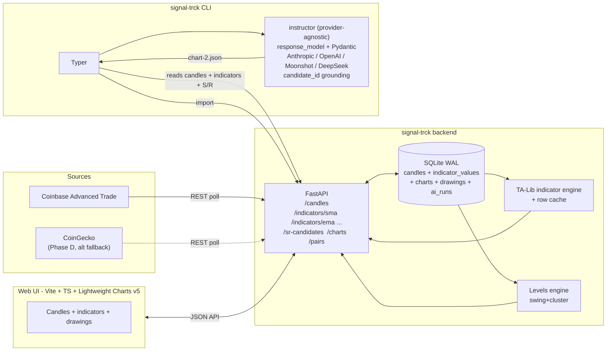

# feat: Crypto charting + AI-assisted technical analysis (signal-trck)

**Status:** Draft v2.1 (post-review + provider-agnostic update) · planning · not yet approved
**Date:** 2026-04-28
**Scope:** Greenfield project in `/Users/hal/Documents/hal/obsidian/forge/signal-trck`
**Sibling repos (reuse candidates):** `leads-ai` (SignalDeck), `signalfetch`
**Review history:** v1 reviewed 2026-04-28 by three reviewers (DHH-style, Kieran-style, code-simplicity); v2 incorporated consensus findings; v2.1 (same-day) added LLM-provider-agnostic execution and dropped the markdown-context token cap. See "Decisions made post-review" below for the changelog.

---

## Overview

Build a **personal, local-first** web app + CLI for longer-term technical analysis of crypto pairs (BTC, ETH, SOL, alts). The web UI renders candlestick charts with manual drawing tools and computed indicators; a CLI command calls a **configurable LLM provider** (Anthropic / OpenAI / Moonshot/Kimi / DeepSeek) to produce a grounded, structured *AI chart* as a first-class artifact alongside the user's own chart, both persisted as versioned `chart.json` documents in a Grafana-dashboard-style format.

The product differentiator is **"chart as code"**: every view — user-made or AI-made — is a diffable JSON artifact with per-object provenance, reading candles from a shared local DB. The AI is **grounded** against pre-computed support/resistance candidates: it picks levels by **candidate ID** from a typed list, never inventing prices.

**The LLM consumes three inputs together** — the central design idea, not an afterthought:

1. **User-supplied qualitative context** — markdown analyses, theses, news roundups.
2. **Raw OHLCV** — candles from the local DB.
3. **Computed price analytics** — indicator series and ranked S/R / trend-line candidates produced by the backend's analysis engine using known financial formulas.

The same computed analytics drive the UI (so the user *sees* what the LLM *reasons over*) and constrain the model's output (so the LLM picks an ID from a typed list rather than emitting a freeform price). One source of truth for both consumers — see the "Architectural decision: where price analytics are computed" section.

## Problem statement

Existing charting tools the user relies on are no longer fit for purpose: they lack persistent annotation workflows on the free tiers, bar sharing of analyses as code, mix live-trading noise into long-horizon analysis, or provide no programmatic hook for LLM-assisted review. The user wants to move from "TA as a UI-bound session" to "TA as versioned, reviewable artifacts" while keeping a proper interactive chart for the visual part of the work.

Secondary problem: the two sibling repos (`leads-ai`, `signalfetch`) already scaffold the SignalDeck "signals in → structured analysis out" idea for news/feeds, but neither touches price data. `signal-trck` fills that slot and reuses their plumbing (LLM client factory, async SQLite store, config loader, Obsidian output sink).

## Proposed solution

Three components, one DB:

1. **Backend + UI (`signal-trck web`)** — FastAPI + SQLite + TradingView Lightweight Charts v5 with a Vite + TypeScript frontend. Candles fetched from Coinbase Advanced Trade (primary, public, no key). Indicators + S/R candidates computed server-side with TA-Lib so the UI and the AI see byte-identical numbers.
2. **AI analysis CLI (`signal-trck ai analyze`)** — Typer command that loads a `chart-1.json`, reads the same candles + indicators from DB, computes S/R candidates with stable IDs, optionally ingests a markdown context file, and calls the configured LLM provider via the [`instructor`](https://github.com/instructor-ai/instructor) library with a Pydantic-validated structured-output schema. Provider (Anthropic / OpenAI / Moonshot/Kimi / DeepSeek) is selected by `LLM_PROVIDER` env var or `--provider` flag. **The LLM emits a `candidate_id`; the server resolves it to a price** — eliminating the float-equality fragility of a `Literal[float, ...]` enum and making the "no AI-drawn price outside the candidate set" property test true *by construction*, regardless of which provider is used.
3. **chart.json schema** — The contract between UI, CLI, AI, and git. Integer `schemaVersion`, integer relative time windows (`default_window_days: 90`), per-object **Provenance** as a nested object, separation of `data` refs from `view` state. DB is source of truth; JSON is an export artifact, re-importable.



## Technical approach

### Architecture

**Layered, additive** on the existing `signalfetch` / `leads-ai` idioms.

- **`src/adapters/`** — `coinbase.py` is the only adapter for v1. CoinGecko added in Phase D *if* a tracked alt isn't on Coinbase. Selection is `if source == "coinbase": ...` until n≥3 justifies a `typing.Protocol`. **No ABC, no registry** — those were premature for n=1.
- **`src/storage/sqlite.py`** — async aiosqlite store modeled on `signalfetch/src/storage/sqlite.py:15`. **WAL mode** enabled so the long-running web server and the writing CLI can share the DB. A thin `Store` class owns all SQL strings — no `await db.execute("SELECT …")` sprinkled across the codebase.
- **`src/indicators/`** — TA-Lib wrapped in `compute(name, params, series) -> np.ndarray`. Results persisted as **rows** in `INDICATOR_VALUES (pair_id, interval, name, params_hash, ts_utc, value)` keyed by composite PK. Range queries are simple `WHERE ts_utc BETWEEN ...`. Append-only when new candles arrive.
- **`src/levels/`** — S/R + trend candidate engine. **v1 ships swing-highs/lows + agglomerative clustering only.** Each candidate carries a `method` field so adding pivot points / volume profile later is purely additive.
- **`src/api/`** — FastAPI routers per resource: `/pairs`, `/candles`, `/charts`, `/sr-candidates`, **per-indicator routes** (`/indicators/sma`, `/indicators/ema`, `/indicators/rsi`, …) — each with its own Pydantic query model. No querystring sprawl. Bind to `127.0.0.1` only.
- **`web/`** — Vite + TypeScript SPA at the top level (not under `src/`, so the Python tree stays clean). Lightweight Charts v5 + `deepentropy/lightweight-charts-drawing` plugin (vendored if upstream goes stale).
- **`src/cli/`** — Typer app. Commands: `web`, `fetch`, `pair add|list|set-context`, `chart import|export`, `ai analyze`, `dev seed`.
- **`src/llm/`** — Provider-agnostic LLM wrapper using the [`instructor`](https://github.com/instructor-ai/instructor) library. Reuses the client-factory idiom from `signalfetch/src/processing/summarizer.py:39` (already supports Anthropic / OpenAI / DeepSeek; extend with Moonshot/Kimi via its OpenAI-compatible endpoint). Defines the `ChartAnalysis` Pydantic model. Provider selected via `LLM_PROVIDER` env (`anthropic | openai | moonshot | deepseek`); per-provider keys via `ANTHROPIC_API_KEY` / `OPENAI_API_KEY` / `MOONSHOT_API_KEY` / `DEEPSEEK_API_KEY` in `~/.signal-trck/config.toml`. The CLI accepts `--provider` and `--model` to override per-run.
- **`src/chart_schema/`** — Pydantic models for the `chart.json` schema (single integer `schemaVersion`). Migrations folder lives here but starts empty.
- **`config.yaml` + `.env`** — YAML for pairs, intervals, defaults, default `LLM_PROVIDER` and per-provider default models; `.env` for the active provider's API key (`ANTHROPIC_API_KEY` | `OPENAI_API_KEY` | `MOONSHOT_API_KEY` | `DEEPSEEK_API_KEY`). Loader lifted from `signalfetch/src/config.py:41`.

### Reliability and observability

These are not phase-end polish — they're load-bearing for a tool whose pitch is "reviewable AI artifacts."

- **`structlog`** with run correlation IDs: every CLI invocation gets a `run_id`; every API request gets a `request_id`; every AI run gets an `ai_run_id` that ties Python logs to the `AI_RUN` row.
- **SQLite WAL mode** (`PRAGMA journal_mode=WAL`) so `signal-trck web` (long-running reader) can run concurrently with `signal-trck ai analyze` (writer).
- **Token-bucket rate limiting** per `(adapter, endpoint)`. Coinbase: 10 req/s. CoinGecko (Phase D): 30 req/min. Empty bucket → `await` with timeout to fail fast on stuck tasks.
- **HTTP fixtures via `pytest-recording`** (async-friendly, modern). Record once with a real key in `.env.test`, replay forever in CI.
- **`signal-trck dev seed`** creates 1 pair + 1 user chart + 1 deterministic AI run with stable fake candidates + candidate IDs, so round-trip tests have stable inputs and the UI has something to render in dev mode.
- **`~/.signal-trck/failed/<timestamp>.json`** dump on AI retry exhaustion — preserves the original LLM response, validator error, and full prompt for prompt-tuning telemetry. Also dumped on the "succeeded after retry" path so prompt drift can be observed.

### Data model

```mermaid
erDiagram
    PAIRS ||--o{ CANDLES : has
    PAIRS ||--o{ CHARTS : has
    PAIRS ||--o{ INDICATOR_VALUES : has
    CHARTS ||--o{ DRAWINGS : has
    CHARTS ||--o{ INDICATOR_REFS : uses
    CHARTS ||--o| AI_RUN : produced_by

    PAIRS {
      string pair_id PK "coinbase:BTC-USD"
      string base
      string quote
      string source
      datetime added_at
      datetime last_viewed_at
      boolean is_pinned
      string pinned_context_path
    }
    CANDLES {
      string pair_id FK
      string interval "1h|1d|1w"
      bigint ts_utc
      float open
      float high
      float low
      float close
      float volume
      string source
    }
    INDICATOR_VALUES {
      string pair_id FK
      string interval
      string name "SMA|EMA|RSI|MACD|BB"
      string params_hash
      bigint ts_utc
      float value
    }
    CHARTS {
      string chart_id PK
      string pair_id FK
      string slug "chart-1"
      string title
      string prov_kind "user|ai"
      string prov_model "nullable, set when prov_kind=ai"
      string prov_prompt_template_version "nullable"
      datetime created_at
      integer schema_version
      integer default_window_days
      string default_interval
      string parent_chart_id "nullable, set on AI forks"
    }
    DRAWINGS {
      string drawing_id PK
      string chart_id FK
      string kind "trend|horizontal|fib|rect"
      json anchors "[{ts_utc, candidate_id?, price}]"
      json style
      string prov_kind "nullable; set only on AI drawings"
      string prov_model "nullable"
      datetime prov_created_at "nullable"
      float prov_confidence "nullable"
      text prov_rationale "nullable"
    }
    INDICATOR_REFS {
      string chart_id FK
      string indicator_id "sma-50, vol, rsi-14"
      string name
      json params
      integer pane
    }
    AI_RUN {
      string chart_id PK_FK
      string model
      string prompt_template_version
      string system_prompt_hash
      string context_file_sha256 "nullable"
      string context_preview "nullable, ~500 chars"
      json sr_candidates_presented "[{id, price, kind, method, ...}]"
      json sr_candidates_selected "[id, id, ...]"
      datetime ran_at
    }
```

**Key schema choices.**
- `pair_id = "{source}:{base}-{quote}"` (e.g. `coinbase:BTC-USD`). Source-prefixed (MCP/k8s convention), URL-safe (no slashes), shell-safe. UI displays the pretty form (`BTC/USD @ coinbase`) — never use the pretty form in URLs or filenames.
- Composite implicit PK on `CANDLES(pair_id, interval, ts_utc)` with `INDEX(pair_id, interval, ts_utc DESC)`. One table, not one-per-interval.
- `INDICATOR_VALUES` is **rows, not JSON blob**. Allows ranged queries, append-only writes when new candles arrive, and cheap join semantics. Composite PK: `(pair_id, interval, name, params_hash, ts_utc)`.
- Timestamps as UTC `BIGINT` epoch-seconds — portable, cheap time math, no TZ bugs.
- UPSERT via SQLite `ON CONFLICT … DO UPDATE`.
- **Provenance** as flat columns on `CHARTS` and `DRAWINGS` (`prov_kind`, `prov_model`, `prov_prompt_template_version`, `prov_confidence`, `prov_rationale`). Sparse on user drawings (all NULL — provenance inherited from chart-level). Always populated on AI drawings.
- `params_hash` strategy locked: `sha256(json.dumps(params, sort_keys=True, separators=(",", ":")).encode()).hexdigest()[:16]`. Float params are coerced to `int` where natural (`period: 50` is always int). Test enforces hash stability.

### `chart.json` schema (v1)

Integer `schemaVersion`. No `$schema` URL (no resolver, pure ceremony). Diffable, portable, re-importable.

**User chart** (Provenance only at chart level; drawings inherit):

```jsonc
{
  "schemaVersion": 1,
  "slug": "chart-1",
  "title": "BTC accumulation thesis — Jan 2026",
  "pair": "coinbase:BTC-USD",
  "provenance": {
    "kind": "user",
    "created_at": "2026-04-22T10:15:00Z"
  },
  "parent_chart_id": null,
  "data": {
    "default_window_days": 90,
    "default_interval": "1d"
  },
  "view": {
    "indicators": [
      { "id": "sma-50", "name": "SMA", "params": { "period": 50 }, "pane": 0 },
      { "id": "vol",    "name": "VOLUME", "params": {},           "pane": 1 }
    ],
    "drawings": [
      {
        "id": "dr-1",
        "kind": "horizontal",
        "anchors": [{ "ts_utc": 1704067200, "price": 42000 }],
        "style": { "color": "#2a9d8f", "dash": "solid" }
      }
    ],
    "analysis_text": null
  },
  "ai_run": null
}
```

**AI chart** (every AI drawing carries its own Provenance + `candidate_id`):

```jsonc
{
  "schemaVersion": 1,
  "slug": "chart-2",
  "title": "AI analysis 2026-04-22",
  "pair": "coinbase:BTC-USD",
  "provenance": {
    "kind": "ai",
    "model": "claude-opus-4-7",
    "prompt_template_version": "v1",
    "created_at": "2026-04-22T11:30:00Z"
  },
  "parent_chart_id": "chart-1",
  "data": { "default_window_days": 90, "default_interval": "1d" },
  "view": {
    "indicators": [ /* same shape as user chart */ ],
    "drawings": [
      {
        "id": "dr-2",
        "kind": "horizontal",
        "anchors": [{
          "ts_utc": 1704067200,
          "candidate_id": "sr-12",
          "price": 42103.5
        }],
        "style": { "color": "#e76f51", "dash": "dashed" },
        "provenance": {
          "kind": "ai",
          "model": "claude-opus-4-7",
          "created_at": "2026-04-22T11:30:00Z",
          "confidence": 0.78,
          "rationale": "Tested 3 times in Q1 2026 with high-volume bounces"
        }
      }
    ],
    "analysis_text": "BTC has consolidated…"
  },
  "ai_run": {
    "model": "claude-opus-4-7",
    "prompt_template_version": "v1",
    "context_file_sha256": "9f8b…",
    "context_preview": "First 500 chars of thesis.md…",
    "sr_candidates_presented_count": 27,
    "sr_candidates_selected": ["sr-12", "sr-19", "sr-23"]
  }
}
```

**Versioning.** Integer `schemaVersion`. On load:
- File version > app version → **error** with clear message: *"This chart is v2; you're running signal-trck v1. Upgrade signal-trck or re-export from a v1 instance."*
- File version < app version → log a warning, attempt to load. The day a real breaking change ships, write a one-shot script in `scripts/migrate_chart_json_vN_to_vM.py`. **No automatic migration framework.**

### Architectural decision: where price analytics are computed

**Decision: backend computes, persists in DB, serves to *both* UI and LLM via the same FastAPI endpoints.** Rejected alternatives below.

**Rationale.**
- **Numeric parity is non-negotiable.** If the UI shows `SMA-50 = 42,103` but the LLM recomputed it to `42,098` (different formula variant, off-by-one window, float order-of-ops), every analysis is silently wrong and unreviewable. One implementation, one source of truth.
- **The interesting analytics need scikit-learn.** Agglomerative clustering for swing-cluster S/R is Python-native; porting to JS is rewriting the analysis engine.
- **Cache is cheap.** `INDICATOR_VALUES` rows for 2 years of daily candles total a few hundred rows per indicator. The S/R candidate set per pair is similarly small.
- **Reproducibility.** A `chart.json` shipped to git produces identical visuals + identical AI-relevant numbers anywhere it loads.

**Alternatives considered and rejected.**

| Option | Why rejected for v1 |
|---|---|
| **Frontend computes on the fly** (e.g. `lightweight-charts-indicators` plugin) | Snappy UI, but breaks numeric parity with the LLM and forces re-implementation of swing-cluster S/R in JS. Acceptable only for *display tweaks* (color, smoothing window the user is dragging interactively), never for the values fed to the model. |
| **MCP server as the LLM's data access path (v1)** | Right answer for *interactive* exploration; wrong for v1's one-shot batch CLI. Also weakens the anti-hallucination guarantee: with `get_sr_candidates` as a tool the model could call it and still emit a price not in the list. The structured-outputs path with a typed `candidate_id` enum is provably tighter. **Demoted from "Phase 7" to "Future considerations"** post-review — see below. |
| **Hybrid: BE computes, FE re-derives for "live preview"** | Two implementations of the same formula. Rejected on simplicity grounds. |

**What this looks like in practice.**
- `GET /pairs/{pair_id}/indicators/sma?period=50&interval=1d&from=…&to=…` returns a JSON time series. Each indicator has its own typed route. The UI plots it. The CLI passes the same payload into the LLM prompt.
- `GET /pairs/{pair_id}/sr-candidates?interval=1d&window_days=90` returns a ranked list of candidates **with stable IDs** (`"sr-1"`, `"sr-2"`, …). The UI can render them as ghosted dotted lines (toggle: "show suggestions"). The CLI passes the same list to the LLM, which emits IDs.

### AI grounding strategy (critical)

LLM never invents prices. The model receives all three input types together — qualitative context, raw prices, computed analytics — and produces an analysis on top. The grounding mechanism is **selection by stable ID, not freeform price emission**.

**Flow.**
1. CLI loads `chart-1.json`, resolves `pair` + `default_window_days` + `default_interval`.
2. Backend reads, in order, from the **same FastAPI endpoints the UI uses**:
   - **Candles** (raw OHLCV) for the window.
   - **Indicator series** the chart enables, byte-identical to what the UI sees.
   - **S/R candidate list** — ranked, typed, **with stable IDs**: `[{id: "sr-1", price, kind, method, touches, strength_score, first_seen, last_touch}, …]`. v1 method: swing-highs/lows + agglomerative clustering on close proximity (~0.5–1% threshold).
   - **Trend-line candidates** — fitted lines through swing-high or swing-low sequences with R² ≥ threshold, also with stable IDs.
3. CLI loads optional **markdown context** (`--context` or pinned per pair). Computes SHA-256 + 500-char preview for the audit record.
4. The configured LLM provider is called via `instructor`'s uniform `response_model` interface:
   - **System:** job description + schema rules + *"every `anchors[].candidate_id` must be one of the IDs in the presented candidate set; every `ts_utc` must exist in the candle array"*.
   - **User:** the four numeric blocks above + the user markdown context (XML-tagged `<user_analysis>`) + the existing `chart-1.json`.
   - `response_model = ChartAnalysis` (Pydantic) — drawing anchors carry `candidate_id: str`, `ts_utc: int`. A Pydantic `model_validator` checks `candidate_id ∈ presented_set` at validate-time, regardless of provider.
   - Provider mechanism: `instructor` uses tool-use mode under the hood for all supported providers (Anthropic, OpenAI, Moonshot, DeepSeek), so the validation guarantee is **independent** of any provider's native structured-output features. Provider quirks (e.g. Anthropic beta headers) are handled inside `instructor`.
5. **Server-side validation:** every `candidate_id` ∈ presented set; every `ts_utc` ∈ candle set. Resolve `candidate_id → price` for storage. Reject + retry once on mismatch; dump to `~/.signal-trck/failed/` on second failure. The "no AI-drawn price outside the candidate set" property test is now **trivially true by construction** (string-set membership check, not float-equality gymnastics).
6. On success: persist `CHARTS` row, `DRAWINGS` rows (each with prov_* and resolved price), `AI_RUN` audit row with full candidate set presented + the IDs the model selected.

### Implementation phases (4)

#### Phase A — "Can the LLM produce a grounded chart at all?" (5–7 days)

The whole point of this app is the AI grounding. Validate it works *before* writing any UI scaffold.

**Deliverables**
- `pyproject.toml` (py311, ruff). Config + storage borrowed from `signalfetch`.
- Coinbase adapter (`src/adapters/coinbase.py`) + token-bucket rate limiter. **1y daily backfill default**; `--hourly` and `--weekly` are explicit on-demand flags.
- CLI: `signal-trck pair add coinbase:BTC-USD`, `signal-trck fetch coinbase:BTC-USD`, `signal-trck dev seed`.
- Indicator engine + `INDICATOR_VALUES` rows table. SMA/EMA/RSI/MACD/BB. `params_hash` locked per the spec above.
- Levels engine: `src/levels/swing_cluster.py`. Returns ranked candidates with stable IDs.
- Hand-write a `chart-1.json` for `coinbase:BTC-USD` in a text editor.
- AI CLI: `signal-trck ai analyze --input chart-1.json [--context md] [--dry-run] [--output chart-2.json] [--provider anthropic|openai|moonshot|deepseek] [--model NAME]`. Provider-agnostic via `instructor`; default provider from `LLM_PROVIDER` env. `ChartAnalysis` Pydantic model with server-side `model_validator` checking `candidate_id ∈ presented_set`. LLM emits `candidate_id`; server resolves to price.
- `AI_RUN` audit table fully populated. `~/.signal-trck/failed/` dump on retry exhaustion.
- `structlog` configured.

**Exit criteria**
- Hand-written `chart-1.json` for BTC-USD; `ai analyze` produces a valid `chart-2.json` in < 30s.
- Property test on ~20 hand-picked candle fixtures (uptrend, downtrend, range, gap, single-candle, all-equal, post-halving rally, etc.): every drawing's `candidate_id` ∈ presented set.
- **No web UI yet.** Read the JSON in the terminal. Decide if the differentiator works before investing in frontend scaffold.

#### Phase B — "Can I see and draw it?" (5–7 days)

**Deliverables**
- `web/` scaffold at top level: Vite + TypeScript + Lightweight Charts v5 + `deepentropy/lightweight-charts-drawing` plugin.
- Panes: price (candles), volume, RSI — configurable via `INDICATOR_REFS`.
- DB tables: `charts`, `drawings`, `indicator_refs`. Pydantic `chart.json` schema + round-trip validator.
- **Save / Save as** — slug auto-incremented per pair (AUTOINCREMENT counter, monotonic, gaps OK). **No fork modal — edit in place; git is the version history.**
- Export `chart.json` (download). Import `chart.json` (upload, validates against `schemaVersion`).
- Sidebar: pair list with chart counts; chart list per pair; search box.
- Timeframe picker (1d / 1w; 1h on demand).

**Exit criteria**
- Open existing BTC-USD candles (from Phase A), draw a horizontal S/R line, save, reload — line persists.
- Round-trip test: hand-write chart, save, export, import → equivalence (deep-equal on JSON modulo timestamps).
- Schema-version mismatch test: load a hand-written v0 file → clear error message; load a hand-written v2 file → clear error message.

#### Phase C — "AI artifacts in the UI" (3–5 days)

**Deliverables**
- `chart import chart-2.json` surfaces in UI as a sibling chart with provenance icon (AI badge, model name).
- Tabbed view: `chart-1 | chart-2` with "Compare" toggle for side-by-side + synced crosshair.
- AI rationale panel (right sidebar) with three tabs:
  - **Analysis** — markdown-rendered `analysis_text`.
  - **Rationale** — per-drawing `rationale` + `confidence`; clicking a line highlights its rationale.
  - **Trace** — candidates presented with picked/rejected, model, `prompt_template_version`, prompt-text behind a "Show prompt" disclosure.
- "Run AI analysis" UI button → modal showing the copy-pastable CLI command pre-filled with the current chart's slug. **(AI runtime stays out of the web server in v1.)**
- Edit-in-place on AI charts: provenance fields stay as historical metadata; git diff shows what the human changed.

**Exit criteria**
- Run `ai analyze` on a real chart; `chart-2` shows up in UI with the rationale panel after import.
- Click an AI-drawn line → rationale + confidence + linked `candidate_id` visible in the panel.

#### Phase D — "Markdown context + Obsidian + polish" (4–6 days)

**Deliverables**
- `--context` file path support. **No app-side token cap** — modern LLMs handle context length themselves; if the provider rejects on context, surface its error message verbatim. Per-run disclosure prints approximate token count + estimated cost (provider+model aware) before the call so the user can Ctrl-C if the number is too high. SHA-256 + ~500-char preview of the context recorded in `AI_RUN`.
- `signal-trck pair set-context coinbase:BTC-USD ./thesis.md` to pin default context per pair. `ai analyze` without `--context` falls back to pinned.
- Obsidian sink (reuse `signalfetch/src/outputs/obsidian.py`): on `ai analyze` success, write a vault note `vault/crypto/<date>-<pair>-analysis.md` with a wiki-link back to the `chart.json`.
- Optional: CoinGecko adapter for alts not on Coinbase.
- `README.md` + screenshots; `docs/architecture.md` and `docs/chart-json-schema.md`.

**Exit criteria**
- `ai analyze` with a 5k-word thesis produces drawings whose `rationale` fields cite specific claims from the markdown.
- Obsidian vault gets a daily entry; the wiki-link opens chart-2 content via Obsidian's preview.

## Decisions made post-review

This v2 incorporates consensus from three reviewers (DHH-style, Kieran-style, code-simplicity, run 2026-04-28).

**Critical fixes (must-do, applied):**
- `pair_id` changed from `BTC/USD@coinbase` (slash breaks FastAPI path parsing) → `coinbase:BTC-USD` (source-prefixed, URL-safe).
- LLM emits `candidate_id` (string), not raw price (float). Server resolves to price. The property test "no AI-drawn price outside the candidate set" is now true by construction.

**Cuts (applied):**
- Schema migration framework + `.bak` siblings → cut. Replaced with integer `schemaVersion` + clear error on mismatch + one-shot scripts in `scripts/` when a real break ships.
- S/R methods 3 → 1 (swing-cluster only). `method` field on candidates makes pivots / volume profile additive later.
- Adapters 3 → 1 (Coinbase only initially; CoinGecko in Phase D if needed). No registry. No ABC — `Protocol` if/when n≥3.
- Phase 7 (MCP server) → demoted from "phase" to a "Future considerations" entry. The FastAPI surface is unchanged.
- 6 phases → 4 (A–D). Phase A combines data + indicators + S/R + AI CLI to validate the differentiator before any UI.
- Copy-on-write fork modal for editing AI charts → cut. Edit in place; git diff is the version history.
- 1000-synthetic-series property test on the S/R engine → cut. Replaced with ~20 hand-picked fixtures.
- `$schema` URL field → cut (no resolver, pure ceremony).
- `default_window: "last-90d"` string parser → cut. Use `default_window_days: 90` (integer).
- `<50ms` cache-hit NFR → dropped (single-user, doesn't matter).
- `--max-tokens` flag → cut. Keep `--dry-run`.
- Per-drawing `created_by` on user drawings → omitted (inherited from chart-level Provenance).

**Restructures (applied):**
- `INDICATOR_SERIES.values json` blob → `INDICATOR_VALUES` rows (queryable by `ts_utc`, append-only).
- `created_by: "user" | "ai:claude-opus-4-7"` string-tagging → `Provenance` nested object: `{kind, model, prompt_template_version, created_at, confidence?, rationale?}`.
- `/indicators?name=SMA&...` querystring → per-indicator routes (`/indicators/sma`, `/indicators/ema`, …) each Pydantic-typed.
- `params_hash` strategy locked: `sha256(json.dumps(params, sort_keys=True, separators=(",", ":")).encode()).hexdigest()[:16]` with int-coercion test.
- Module names: `src/sr/` → `src/levels/`, `src/ai/` → `src/llm/`, `src/schema/` → `src/chart_schema/`, `src/web/` → top-level `web/`.
- 20-item ❓ "gap defaults" section → split into "Decisions" (stated commitments) and "Open questions" (real defer-able choices).

**Additions (applied):**
- Reliability + observability section: structlog with run correlation IDs, SQLite WAL mode, token-bucket rate limiter per adapter, `pytest-recording` for HTTP fixtures, `signal-trck dev seed` command.
- `prompt_template_version` on Provenance + `AI_RUN` so an analysis can be replayed with the same prompt.
- First-load backfill: 2y daily + 6m hourly + all weekly → **1y daily only** (hourly/weekly via on-demand commands).

**User overrides (kept against reviewer suggestion):**
- **Vite + TypeScript** kept (DHH wanted vanilla JS + ESM-on-CDN). Starting with a real framework avoids the migration cost when the SPA grows.
- **Indicator cache table kept** (DHH wanted on-demand recompute). The cache is the parity-enforcement mechanism, not just an optimization. Restructured to row-storage per Kieran.

**v2.1 amendments (user direction, 2026-04-28):**
- **LLM provider-agnostic.** v1 + v2 hard-coded Anthropic SDK + structured-outputs beta. Replaced with the [`instructor`](https://github.com/instructor-ai/instructor) library, which gives a uniform Pydantic `response_model` interface across Anthropic / OpenAI / Moonshot/Kimi / DeepSeek (and any future provider `instructor` adds). Provider via `LLM_PROVIDER` env or `--provider` flag. The grounding mechanism (`candidate_id` selection + server-side `model_validator`) is **provider-independent** — validation happens regardless of provider's native structured-output support.
- **Markdown context cap removed.** v2 had a 50k-token soft cap with hard error above. Modern LLMs handle context length themselves; surface the provider's rejection on overflow rather than pre-capping app-side. App still shows token count + cost estimate before the call so the user can abort if expensive.

## Alternative approaches considered

| Alternative | Why rejected |
|---|---|
| **TradingView Advanced Charts** (full library) | Free license explicitly bars personal/hobby/internal use — violates terms. |
| **KLineChart** | Strong runner-up (ships drawings + indicators out of box). Rejected as primary because Lightweight Charts v5's primitive API + longer-term maintainer track record is safer for a tool expected to live 3+ years. **Plan B** if drawing plugin integration proves painful in Phase B. |
| **SQLAlchemy 2.0 + Alembic** | Used in `leads-ai`. Rejected here because `signalfetch`'s raw aiosqlite pattern is sufficient for the core tables; migrations done by hand initially, switching to `yoyo-migrations` if/when SQLite migrations exceed 6. |
| **pandas-ta** | Library marked for archive July 2026 unless funded. TA-Lib (binary wheels work in 2026) is the safer choice. |
| **WebSocket live candles** | Scope creep. User wants longer-term TA; REST + poll-on-view is sufficient. |
| **AI analysis in-UI button** | Deferred. CLI-only keeps LLM runtime out of the web server and makes the "chart as code" workflow first-class. UI shows a "copy this CLI command" modal instead. |
| **Let the LLM propose raw price levels** | Hallucination-prone (15–52% error rates per 2026 structured-analysis benchmarks). Typed `candidate_id` selection with server-side resolution is the grounding mechanism. |
| **Compute indicators / S/R on the frontend** | Breaks numeric parity between UI and LLM. S/R clustering also requires scikit-learn — not viable in JS. |
| **MCP as the LLM's primary data path in v1** | Right answer for *interactive* exploration; wrong for v1's one-shot CLI. Weakens the anti-hallucination guarantee vs `messages.parse` with a typed `candidate_id` enum. Demoted to "Future considerations". |
| **Migration framework for `chart.json` schema** | YAGNI for a personal tool with 0 written charts. Integer `schemaVersion` + error message + one-shot scripts when a real break ships. |
| **Fork-on-edit for AI charts** | TradingView mimicry. Git diff is the version history. Edit in place. |
| **`Literal[float, ...]` enum on prices** | Float JSON round-trip causes spurious validator rejections. `candidate_id` (string) + server-side resolution is provably tight. |

## Acceptance criteria

### Functional
- [ ] Add and pin pairs: `signal-trck pair add coinbase:BTC-USD`
- [ ] UI renders candlestick chart at daily + weekly (hourly on demand)
- [ ] User can toggle SMA/EMA/RSI/MACD/BB indicators with configurable parameters
- [ ] User can draw trend lines, horizontal S/R lines, Fibonacci retracements, rectangles
- [ ] Drawings + indicators + analysis text persist as a named chart (slug + title)
- [ ] Chart exports to valid `chart.json` (`schemaVersion: 1`)
- [ ] Chart imports from `chart.json` reproducing the exact view
- [ ] `signal-trck ai analyze --input chart-1.json [--context file.md]` produces valid `chart-2.json` in < 30s
- [ ] AI-drawn drawings carry `candidate_id` referencing IDs in `AI_RUN.sr_candidates_presented`
- [ ] AI chart shows in UI as a sibling tab with provenance, rationale panel, trace panel
- [ ] Editing an AI chart edits in place; git diff shows what changed
- [ ] Markdown context: path support, no app-side cap (provider-side limit only); SHA-256 + ~500-char preview recorded in `AI_RUN`; per-run token-count + cost disclosure printed before the call
- [ ] Data-exfil disclosure on every `ai analyze` run; first-run confirmation prompt
- [ ] `--dry-run` prints the would-be output without writing or touching DB

### Non-functional
- [ ] First chart render for a newly-saved pair (1y daily backfill): **< 30s**
- [ ] Server binds only to `127.0.0.1`; never `0.0.0.0`
- [ ] `~/.signal-trck/config.toml` created with file mode `0600`; install check fails loudly otherwise
- [ ] SQLite uses WAL mode (`PRAGMA journal_mode=WAL`)
- [ ] `chart.json` files are git-diffable (stable key ordering, no floats with > 8 decimals)
- [ ] `structlog` JSON logging mode available via `--log-format json`

### Quality gates
- [ ] Round-trip test: user draws → save → export → import → equivalence
- [ ] Property test on ~20 hand-picked candle fixtures: every AI drawing's `candidate_id` ∈ presented set, every `ts_utc` ∈ candle set
- [ ] `params_hash` stability test: `{"period": 50}` and `{"period": 50.0}` resolve consistently (lock the canonicalization rule)
- [ ] Schema-mismatch test: a hand-written v0 file or v2 file produces a clear error
- [ ] Adapter rate-limit test: token-bucket blocks correctly when bucket empty
- [ ] Ruff clean; match ruff config from `leads-ai` (`py311`, line 100, `select = ["E","F","I","N","UP","B","SIM"]`)

## Decisions

These were marked ❓ in v1 spec-flow analysis but are now committed (no decision needed):

1. Charts have a stable slug (`chart-1`, `chart-2`…) + editable title. AI runs always create a new chart (not revision-track).
2. AI charts are edited in place; git is the version history. No fork modal.
3. Every indicator in `chart.json` has an explicit `params` block; multiple instances of same indicator allowed.
4. Pair canonical id `coinbase:BTC-USD`; resolver tries Coinbase first, falls back to CoinGecko USD (Phase D), with a visible "proxy" badge if a USDT pair is used as a USD proxy.
5. First-load backfill: 1y daily; hourly + weekly on demand via explicit flags.
6. `chart.json` versioning: integer `schemaVersion`, error on mismatch, no auto-migration framework.
7. AI failure modes: retry once on validator mismatch, dump to `~/.signal-trck/failed/`. `--dry-run` supported.
8. AI output panel: Analysis / Rationale / Trace tabs; prompt hidden behind "Show prompt".
9. `chart.json` portable across machines; pair ids never DB primary keys; no secrets embedded.
10. Local-only, no auth, `127.0.0.1` bind, explicit data-exfil disclosure per AI run.
11. Multi-chart comparison: tabbed default; "Compare" toggle for side-by-side with synced crosshair.
12. Pair aliasing / rebranding: out of scope for v1 — tracked in `todo/aliases.md`.
13. AI analysis is CLI-only in v1; UI has "Run AI analysis" modal showing copy-pastable CLI command.
14. v1 output = S/R + trend + Fib + text summary only; no entries/exits, no risk/reward, no price targets.
15. DB is source of truth; `chart-*.json` on disk is an export artifact re-imported via explicit command.
16. **LLM provider is configurable, not hard-coded.** Anthropic / OpenAI / Moonshot/Kimi / DeepSeek selectable via `LLM_PROVIDER` env or `--provider` CLI flag. Default model per provider in config. The `instructor` library provides the uniform Pydantic-validated interface across providers.
17. **No app-side markdown-context token cap.** The LLM provider's own context-length limit is the constraint; on rejection, surface the provider's error verbatim. App displays approximate token count + estimated cost before the call so the user can abort.

## Open questions

Real defer-able choices — speak up to override the proposed default before implementation. (v2.1: items 1, 2, 3, and 5 confirmed by user; item 4 dropped — no app-side context cap.)

1. **Saved-pair lifecycle.** Confirmed: persist `{symbol, source, added_at, last_viewed_at, is_pinned, pinned_context_path}`; cold start shows last-viewed pair + last-opened chart.
2. **Time-window interaction.** Confirmed: `default_window_days` is *relative* (always "last N days from now"). Zoom does **not** auto-switch interval. "Export" captures saved default; separate "Export current view" captures zoom-as-default.
3. **Data refresh model.** Confirmed: hybrid — scheduler refreshes pinned pairs (15 min for hourly, hourly for daily, daily for weekly); on-demand fetch when a pair is opened with stale data.
4. **Discovery sidebar UX.** Confirmed: pinned pairs at top; expandable per-pair chart list with provenance icons; search box; tags deferred to v2.

## Success metrics

- **Weekly analysis cadence:** user runs `ai analyze` ≥ 1×/week on a pinned pair within 4 weeks of v1 release.
- **Grounding integrity:** 0 AI-drawn `candidate_id`s outside the presented set across 100 real runs (this is enforced by construction; the metric is a sanity check).
- **"Chart as code" loop:** ≥ 5 `chart.json` files committed to a git repo within the first month.
- **Reuse leverage:** ≥ 3 modules imported (not copied) from `signalfetch` once a `signaldeck-core` package is extracted (out of v1).

## Dependencies & prerequisites

- Python 3.11+
- TA-Lib Python package 0.6.5+ (binary wheels; no Homebrew needed)
- Node 20+ + Vite for the UI build
- An LLM provider API key — at least one of `ANTHROPIC_API_KEY` / `OPENAI_API_KEY` / `MOONSHOT_API_KEY` (Kimi) / `DEEPSEEK_API_KEY`. Stored in `~/.signal-trck/config.toml` (mode 0600). Active provider chosen via `LLM_PROVIDER` env or `--provider` flag.
- `instructor` Python library for the multi-provider LLM interface
- CoinGecko Demo API key (Phase D; optional)
- Chrome / Firefox recent
- macOS or Linux local dev

External:
- Coinbase Advanced Trade API (public, no key)
- CoinGecko Demo API (Phase D)
- One of: Anthropic Messages API / OpenAI Chat Completions / Moonshot (Kimi) Chat / DeepSeek Chat — accessed uniformly via `instructor`'s tool-use mode

## Risks & mitigations

| Risk | Likelihood | Impact | Mitigation |
|---|---|---|---|
| `instructor` API surface or provider quirks change across versions | Low | Med | Pin `instructor` version; wrap the call site behind `src/llm/`; cover with `pytest-recording` fixture per supported provider |
| `deepentropy/lightweight-charts-drawing` plugin abandonware | Med | Med | Vendor-in the plugin code; KLineChart as Plan B (Phase B would swap) |
| pandas-ta archive July 2026 | High | Low | Already rejected in favor of TA-Lib |
| CoinGecko Demo free-tier dropped or re-priced | Med | Med | Phase D-only adoption; one-file adapter swap |
| LLM bills balloon on long context | Low | Med | Per-run disclosure of approximate token count + cost (provider+model aware) before the call; user can Ctrl-C if the number is too high; provider-side context-limit error surfaces verbatim if exceeded |
| Provider differences in tool-use schema acceptance (e.g. one provider rejects long enums) | Med | Med | `instructor` normalizes most quirks; for the candidate-id enum, cap presented candidates to a top-N (default 50) so no provider chokes on enum length |
| Candle gaps / bad data silently break indicators | Med | High | Store `source` per candle; gap detection refuses to compute indicators on incomplete series; surface gap warnings in UI |
| `params_hash` collisions on float vs int params | Low | High | Locked canonicalization rule + dedicated test |
| User uploads sensitive markdown context without realizing it's sent to the configured LLM provider | Low | High | First-run confirmation + one-line disclosure on every `ai analyze` run, naming the active provider + model |
| Shitcoin symbol ambiguity (e.g., two different `PEPE`s) | High for alts | Med | Pin `pair_id` by source-namespaced canonical id; document in `docs/alt-symbols.md` |
| SQLite locking with concurrent web + CLI | Med | High | WAL mode mandatory; integration test |

## Resource requirements

- 1 engineer (solo)
- Estimated effort: **4 phases × 4–7 days each = ~3 weeks elapsed full-time**, or **5–7 weeks part-time**
- LLM provider API budget: ~$10–30/month at expected analysis cadence (Anthropic / OpenAI tier; Kimi/DeepSeek will be cheaper, often by 5–10×)
- Disk: SQLite DB stays well under 1 GB for 10 pairs × 3 intervals × 5 years

## Future considerations (out of v1 scope)

- **MCP server facade** (was previously slated as Phase 7; demoted post-review). The FastAPI surface already serves the right shape — when the "open Claude Code in this repo and ask questions about my charts" workflow becomes valuable, wrap the existing handlers as MCP tools. Zero rework; rev the spec when actually needed.
- **Ingest `signalfetch`'s crypto-topic feeds** (Bankless, a16z crypto, TLDR Crypto) as automatic qualitative context for the AI prompt ("what's happening this week?") via a read-only handle on `signalfetch.db`.
- **Hook into `leads-ai` SignalDeck** as "source: crypto-price-signals" adapter (a price-cross-thesis is a kind of signal).
- **In-UI AI invocation** (remove the CLI-only constraint).
- **Backtesting engine** that simulates the AI-suggested S/R as trade triggers.
- **Extract `signaldeck-core`** PyPI-internal package once duplication across the three repos becomes painful (LLM client factory + config loader + Obsidian sink).
- **Multi-user mode** with per-user auth (probably never — stay local-first).
- **Options / futures / perps data.**
- **Pair aliasing** + on-chain data (DEX volume, holder counts).
- **Saved prompt templates per pair** (e.g., "analyze as macro", "analyze as momentum").
- **Pivot points + volume profile** as additional S/R candidate methods (the `method` field is already there).

## Documentation plan

- `README.md` — what it is, quick-start, screenshot, CLI cheatsheet
- `docs/architecture.md` — this plan's "Technical approach" section, kept in sync
- `docs/chart-json-schema.md` — full schema reference + example + migration notes
- `docs/ai-grounding.md` — how `candidate_id` selection works and why the LLM can't invent prices
- `docs/reuse-from-signaldeck.md` — what was copied from `signalfetch` / `leads-ai` and why
- `docs/alt-symbols.md` — shitcoin symbol disambiguation policy
- `todo/aliases.md`, `todo/future.md` — parking lot

## References

### Internal (sibling repos)

- `signalfetch/src/cli.py:24` — CLI skeleton pattern
- `signalfetch/src/config.py:41` — YAML+`.env` config loader
- `signalfetch/src/storage/sqlite.py:15` — async aiosqlite store template
- `signalfetch/src/processing/summarizer.py:39` — Anthropic/OpenAI/DeepSeek client factory
- `signalfetch/src/outputs/obsidian.py` — Obsidian markdown sink
- `signalfetch/src/models.py:41` — `compute_hash()` dedup helper
- `leads-ai/src/extraction/models.py:8` — Pydantic structured-response pattern
- `leads-ai/plans/database-schema.md` — prior-art schema reference

### External

- [TradingView Lightweight Charts v5 release](https://github.com/tradingview/lightweight-charts/releases/tag/v5.1.0)
- [Lightweight Charts — Series Primitives](https://tradingview.github.io/lightweight-charts/docs/plugins/series-primitives)
- [deepentropy/lightweight-charts-drawing](https://github.com/deepentropy/lightweight-charts-drawing)
- [KLineChart overlay guide](https://klinecharts.com/en-US/guide/overlay) (Plan B)
- [Coinbase Advanced Trade — Get product candles](https://docs.cdp.coinbase.com/api-reference/advanced-trade-api/rest-api/products/get-product-candles)
- [Coinbase Exchange rate limits](https://docs.cdp.coinbase.com/exchange/rest-api/rate-limits)
- [CoinGecko API pricing (Demo tier)](https://www.coingecko.com/en/api/pricing)
- [TA-Lib Python (wheels in 0.6.5+)](https://pypi.org/project/TA-Lib/)
- [pandas-ta archive warning](https://pypi.org/project/pandas-ta/)
- [`instructor`](https://github.com/instructor-ai/instructor) — multi-provider LLM with Pydantic structured outputs (Anthropic / OpenAI / Moonshot/Kimi / DeepSeek and others)
- [Anthropic Structured Outputs docs](https://platform.claude.com/docs/en/build-with-claude/structured-outputs)
- [OpenAI structured outputs](https://platform.openai.com/docs/guides/structured-outputs)
- [Moonshot / Kimi platform docs](https://platform.moonshot.ai/docs/) — OpenAI-compatible API, accessible via `instructor`'s OpenAI client pointed at the Moonshot endpoint
- [DeepSeek API docs](https://api-docs.deepseek.com/)
- [Claude Cookbook — extracting structured JSON](https://github.com/anthropics/anthropic-cookbook/blob/main/tool_use/extracting_structured_json.ipynb)
- [Grafana dashboard JSON model](https://grafana.com/docs/grafana/latest/visualizations/dashboards/build-dashboards/view-dashboard-json-model/)
- [Storing financial time-series in SQLite (Ericdraken)](https://ericdraken.com/storing-stock-candle-data-efficiently/)
- [QuantMCP — grounding LLMs in financial reality](https://arxiv.org/html/2506.06622v1)
- [LLM hallucination statistics 2026](https://sqmagazine.co.uk/llm-hallucination-statistics/)
- [structlog](https://www.structlog.org/) — structured logging
- [pytest-recording](https://github.com/kiwicom/pytest-recording) — async-friendly HTTP fixtures
- [SQLite WAL mode](https://www.sqlite.org/wal.html)
- [Model Context Protocol](https://modelcontextprotocol.io/) — Future considerations
