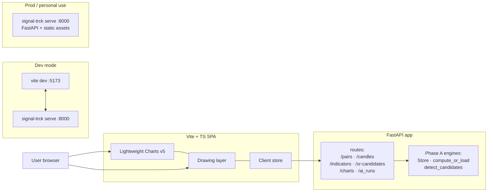
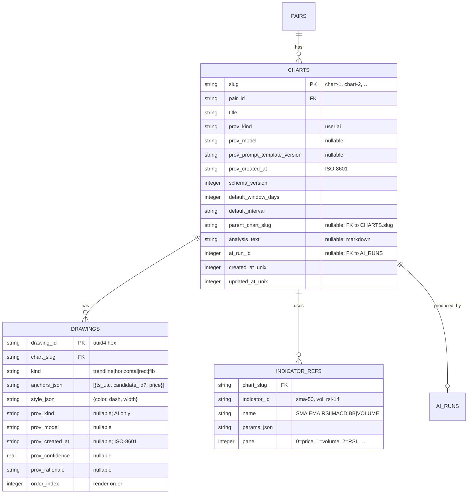

# feat: Phase B — web UI + FastAPI backend (signal-trck)

**Status:** Draft v1 · planning · not yet approved
**Date:** 2026-04-30
**Scope:** Phase B of the signal-trck project — web UI scaffold, FastAPI backend, drawing layer, chart persistence
**Parent plan:** [`plans/feat-crypto-charting-ai-analysis.md`](./feat-crypto-charting-ai-analysis.md) (v2.1 — committed decisions are not re-litigated here)
**Phase A retrospective:** [`docs/architecture.md`](../docs/architecture.md)
**Predecessor:** Phase A complete (`master` HEAD `e965613`); 144 tests passing; ruff clean
**Successor:** Phase C ("AI artifacts in the UI") — kept separate per parent plan

---

## Overview

Phase A delivered a working CLI-only pipeline: hand-write a `chart-1.json`, run `signal-trck ai analyze`, get a grounded `chart-2.json` out. The whole differentiator (LLM grounding via `candidate_id`) is validated end-to-end. **What's missing is the half a human can use:** a candlestick chart they can look at, indicators they can toggle, drawings they can place, and a way to load + compare AI-produced charts visually.

Phase B builds that half — and only that half. Phase C ("AI artifacts in the UI" with rationale + trace panels) and Phase D ("markdown context + Obsidian + polish") are explicitly **out of scope** here, per the parent plan. The goal is a usable charting UI that round-trips `chart.json` cleanly. The AI-rationale UX is a follow-on once the visual surface exists to host it.

This sub-phase introduces the project's first **network surface**, which raises a security baseline that was deferred while the tool was local-process-only (see `todos/011-pending-p3-rerun-pending-reviewers.md` — security review was deferred precisely because Phase A had no listener). Phase B closes that gap with a concrete checklist rather than waiting for an after-the-fact audit.

## Problem statement

The Phase A CLI works but is unusable for actual analysis: the user has to hand-edit JSON to specify the chart they want to see, then squint at JSON to read what the LLM produced. That's fine to validate the grounding mechanism — it is not a real workflow.

Three concrete problems to solve in Phase B:

1. **No visual chart.** The user wants candles, volume, indicators (SMA/EMA/RSI/MACD/BB), and to see them at the same scale the LLM does. Without a chart, the "look at it and decide" step doesn't exist.
2. **No drawing tools.** Manual S/R lines and trend lines are the user's *primary* TA workflow per the parent plan ("user can display extra moving average … and add a support line found visually"). Today they don't have any way to do this.
3. **No persistence story for user charts.** Phase A keeps `chart.json` files on disk via `chart_io.py`; there's no UI-driven save/load and no DB backing. Charts go in/out of memory only via the CLI. This blocks the "save chart-1, then run AI on it" loop the parent plan calls out.

A secondary problem: **Phase A integration points are documented but unexposed.** `Store.list_pairs`, `compute_or_load`, `detect_candidates`, `Store.list_ai_runs` all exist as Python functions and are listed in `docs/architecture.md` as "Phase B will wrap these over HTTP". Phase B does that wrapping.

## Proposed solution

A **two-process** layout in dev (Vite frontend + FastAPI backend on separate ports), collapsed to a **single process** in prod (`signal-trck serve` mounts the prod-built frontend assets and the API under one ASGI app, on `127.0.0.1` only).

### High-level flow



### What lands

- **`src/signal_trck/api/`** — FastAPI app. Routes thinly wrap existing Phase A functions. No business logic in the router layer.
- **`src/signal_trck/cli/serve.py`** — `signal-trck serve [--host 127.0.0.1] [--port 8000] [--reload]`. Boots uvicorn with the FastAPI app and (in prod mode) mounts the built `web/dist/` as static files at `/`.
- **`web/`** — Vite + TypeScript SPA at the project root (not under `src/` — keeps the Python tree clean, separate `package.json`).
- **Lightweight Charts v5** wired up to render candles + overlays (SMA/EMA on price pane) + sub-panes (RSI, MACD, volume).
- **Drawing layer** — trend lines, horizontal S/R lines, rectangles. Plugin choice: open question (see §"Open questions").
- **DB tables: `charts`, `drawings`, `indicator_refs`** added in migration `v4`. Round-trip with the Pydantic `chart_schema` models.
- **Schema-version error UX** — load a `chart.json` whose `schemaVersion` doesn't match the running app and the UI shows a clear error, not a silent crash.

### What does NOT land

- AI rationale panel, trace panel, "Compare" toggle, side-by-side AI/user view → **Phase C**.
- Markdown context upload UI, Obsidian export, scheduled refresh, pinned-pair auto-fetch → **Phase D**.
- In-browser "Run AI analysis" button. Phase B keeps the parent plan's stance: AI runtime stays in the CLI; the UI surfaces a "copy this CLI command" affordance only — but that affordance is a Phase C deliverable, not Phase B.
- Real-time / WebSocket candles — out of v1 scope per parent plan.
- Multi-user, auth, HTTPS — local-only personal tool.

## Technical approach

### Backend architecture (FastAPI)

#### Module layout

```
src/signal_trck/api/
├── __init__.py            — package marker
├── app.py                 — module-level `app = FastAPI(lifespan=...)`; inline `get_store` dep; structured access log
├── routes.py              — all 14 handlers + per-indicator-name Pydantic params models inline
└── errors.py              — exception handlers (PairNotFound → 404, etc.)
```

Three files, not eleven. Phase A's `store.py` holds all SQL for the project; the same "one file per concern" discipline applies here. Routes are thin wrappers over Phase A functions — splitting them across six router files for fourteen handlers is theatre. Split when one file genuinely hurts (~400 LOC), not before.

`app = FastAPI(lifespan=...)` is module-level (no `build_app()` factory). Tests use `httpx.AsyncClient(transport=ASGITransport(app=app))` against an isolated `Store` injected via dependency override — same testability, no factory ceremony.

#### Routes

All routes are JSON in / JSON out, Pydantic-validated both directions, async-native (the entire stack is async; `instructor` is the only sync island and it's deliberately kept in the CLI).

| Verb   | Path                                                     | Wraps (Phase A)                              | Notes |
|--------|----------------------------------------------------------|----------------------------------------------|-------|
| GET    | `/healthz`                                               | —                                            | liveness probe; returns build SHA |
| GET    | `/pairs`                                                 | `Store.list_pairs`                           | |
| POST   | `/pairs`                                                 | `pair_id.parse` + `Store.add_pair`           | body: `{pair_id}` |
| DELETE | `/pairs/{pair_id}`                                       | `Store.remove_pair` (new — see §Storage)     | |
| GET    | `/pairs/{pair_id}/candles`                               | `Store.get_candles`                          | query: `interval`, `from`, `to`, or `window_days` |
| GET    | `/pairs/{pair_id}/indicators/{name}`                     | `compute_or_load`                            | query: flat params (e.g. `?period=20&interval=1d&window_days=90`); router dispatches on `name` to per-indicator Pydantic params model |
| GET    | `/pairs/{pair_id}/sr-candidates`                         | `levels.detect_candidates`                   | query: `interval`, `window_days`, `top_n` |
| POST   | `/pairs/{pair_id}/refresh`                               | `adapters.coinbase.fetch_candles` (existing) | body: `{interval, days}`; returns count fetched. _Verify the actual Phase A function name during B implementation — `docs/architecture.md` references `fetch` CLI but the underlying adapter function name needs confirmation._ |
| GET    | `/charts`                                                | `Store.list_charts` (new)                    | query: `pair_id?`, `limit?` |
| GET    | `/charts/{slug}`                                         | `Store.get_chart` (new) → Pydantic `Chart`   | 404 if missing |
| POST   | `/charts`                                                | `Store.create_chart` (new)                   | body: `Chart` Pydantic model; 409 if slug exists |
| PUT    | `/charts/{slug}`                                         | `Store.update_chart` (new)                   | edit-in-place (parent plan §"no fork modal"); 404 if slug missing |
| DELETE | `/charts/{slug}`                                         | `Store.delete_chart` (new)                   | wrapped in single transaction (drawings + indicator_refs + chart) |
| GET    | `/charts/{slug}/export`                                  | `chart_io.write_chart` (file → response)     | returns the canonical JSON file as download |
| POST   | `/charts/import`                                         | `chart_io.read_chart` + `Store.write_chart`  | multipart upload of a `chart.json` |
| GET    | `/pairs/{pair_id}/ai_runs`                               | `Store.list_ai_runs`                         | exists today; just expose |

**Per-indicator routes vs single querystring route.** Parent plan v2.1 §post-review locked per-indicator routes (`/indicators/sma`, `/indicators/ema`, …). Re-evaluated for Phase B: with 5 indicators the per-route approach is 5 handlers of ~30 LOC each. A single `/indicators/{name}` with **flat query params** (e.g. `?period=20&interval=1d&window_days=90`) and a router-side dispatch on the `name` path param to a per-indicator Pydantic params model is half the code, same type safety. (Note: a Pydantic discriminated union with FastAPI's nested-query-binding would have been cleaner-on-paper but FastAPI doesn't bind discriminated unions to flat querystring; either you JSON-encode the params blob (worst of both worlds, defeats auto-validation) or you dispatch in the router. We dispatch.) **Decision: deviate from parent — single route with `name` path param + per-name Pydantic params dispatched in the handler.** If a future indicator needs wildly different query shape (it won't for SMA/EMA/RSI/MACD/BB), split then. Documented as a deliberate deviation in `docs/architecture.md` post-Phase-B.

#### Async story

`Store` is already async; FastAPI is async-native. The router layer is `async def` end-to-end. **Where Phase A's `cli/_runner.py:run_async` was needed** (to call async store methods from a sync Typer command), Phase B avoids that altogether — the router *is* the async boundary, and the Phase A engines are imported as plain async functions.

The one wrinkle: `compute_or_load` calls TA-Lib synchronously inside an async function. TA-Lib operations are CPU-bound and ~1ms; this is fine inline. If a single chart load ever ends up computing 50 indicators across multi-year hourlies the math changes, but at v1 scale (< 5000 candles, ≤ 5 indicators per chart) inline is correct.

#### Auth, binding, CORS

- **Hardcode bind to `127.0.0.1`**, never `0.0.0.0`. No `--allow-non-loopback` escape hatch (undocumented escape hatches are how production accidents happen — a user who actually needs tailnet access can edit the source).
- **No auth.** Personal tool; the binding-to-loopback is the security boundary.
- **CORS in dev mode only.** `signal-trck serve --reload` adds `http://localhost:5173` to allowed origins (Vite dev server). Prod mode (no `--reload`) serves frontend assets from the same origin and disables CORS entirely. A flag like `SIGNAL_TRCK_DEV=1` from the env is the cleanest discriminator; documented as a tested public contract in `docs/architecture.md`, not a magic env var.
- **API keys never on the wire to the frontend.** `ANTHROPIC_API_KEY` etc. live in `~/.signal-trck/config.toml` (`0600` per parent plan); the frontend never sees them, never sends them, never asks about them. **API-key sentinel test** (`tests/api/test_api_key_redaction.py`): set `ANTHROPIC_API_KEY=sentinel-xyz-12345`, hit every error path + every successful response, grep the response body for the sentinel — must never appear.

#### Error handling

A single FastAPI exception handler maps domain errors to HTTP:

| Exception                                                  | HTTP | Body shape                                       |
|------------------------------------------------------------|------|--------------------------------------------------|
| `pair_id.PairIdError`                                      | 400  | `{detail: "...", code: "INVALID_PAIR_ID"}`       |
| `Store.PairNotFound`                                       | 404  | `{detail: "...", code: "PAIR_NOT_FOUND"}`        |
| `Store.ChartNotFound`                                      | 404  | `{detail: "...", code: "CHART_NOT_FOUND"}`       |
| `Store.ChartSlugConflict`                                  | 409  | `{detail: "...", code: "CHART_SLUG_CONFLICT"}`   |
| `chart_schema.SchemaVersionError`                          | 422  | `{detail: "...", code: "SCHEMA_MISMATCH"}`       |
| `pydantic.ValidationError`                                 | 422  | FastAPI default                                  |
| `aiosqlite.OperationalError` matching `^(database is locked|disk I/O error)` | 503 | `{detail: "db unavailable", code: "DB_BUSY"}` |
| Anything else (incl. other `OperationalError`s — they're bugs, not transient) | 500 | `{detail: "internal error", code: "INTERNAL"}` |

`code` strings give the frontend stable enums to switch on without parsing English error messages.

#### Observability

- **No `request_id` middleware.** Single user, single localhost, no aggregator — there's never a second concurrent request to correlate against. Phase A's existing `log.py` run-id contextvar covers what we need.
- **Structured access log**: one log line per request at info level: `method`, `path`, `status`, `duration_ms`. Lives in `app.py` as a single ~15-line ASGI middleware function (no separate file). Same `--log-format json` flag from Phase A's `cli/main.py` applies.
- **Slow-query log**: requests over 1s are flagged in the access-log middleware. 1s is generous given the v1 dataset; the alarm is for when the cache silently misses.

### Frontend architecture (Vite + TypeScript)

#### Top-level layout

```
web/
├── package.json           — pinned versions; private; no publish
├── vite.config.ts         — proxy /api → :8000 in dev
├── tsconfig.json          — strict + noUncheckedIndexedAccess + exactOptionalPropertyTypes
├── index.html
├── public/                — favicon, etc.
└── src/
    ├── main.tsx           — entry
    ├── api.ts             — typed fetch wrapper for all 14 routes; consistent error → typed exception
    ├── api-types.ts       — generated by `openapi-typescript` from FastAPI's /openapi.json
    ├── chart/             — Lightweight Charts v5 wiring
    │   ├── ChartView.tsx  — top-level chart component (panes, candles, indicators)
    │   ├── panes.ts       — pane orchestration (price / volume / RSI sub-pane)
    │   ├── overlays.ts    — overlay-indicator rendering (SMA/EMA on price pane)
    │   └── format.ts      — price/time formatters
    ├── drawings/          — drawing layer
    │   ├── DrawingLayer.tsx
    │   ├── tools/
    │   │   ├── TrendLine.ts
    │   │   ├── HorizontalLine.ts
    │   │   └── Rectangle.ts
    │   ├── styles.ts      — solid stroke for user, dashed for AI provenance (Phase C scaffolding)
    │   └── serialize.ts   — drawing → chart_schema.Drawing JSON, both directions
    ├── store.ts           — single zustand store: chart state + tools (active drawing tool, hover/select)
    ├── views/             — top-level routes
    │   ├── PairList.tsx   — left sidebar (chart cards plain in B; AI badge added in C)
    │   ├── PairView.tsx   — main: chart + indicator panel + chart list
    │   └── ChartImport.tsx
    └── styles/            — minimal CSS; no design system in v1
```

One `api.ts` not six. One `store.ts` not two — selectors give per-component subscription granularity at the call site; the chart-vs-tools split was theoretical optimization. **No empty `RationalePanel.tsx`** — the third column lands in Phase C as a one-edit CSS-grid addition. Drop file overhead now; revisit when C arrives.

#### Chart rendering strategy

- **One `IChartApi` per `PairView` mount.** Indicators come and go via `addLineSeries` / `removeSeries`. Volume gets its own pane via the v5 panes API. RSI and MACD get sub-panes too.
- **Data flow:** mount `PairView(pair_id, slug?)` → fetch chart JSON via `GET /charts/{slug}` (or build a default chart for the pair) → for each indicator in the chart, `GET /pairs/{id}/indicators/{name}?...` → render into the right pane → for each drawing, hand to the drawing layer.
- **Re-render on edit:** when the user changes a chart parameter (e.g., adds SMA-50), append the indicator ref to the in-memory `chart` store, kick off the API call, and on response add the line series. No full re-render of the chart object; we mutate series-by-series. Stable-ref tip from the v5 docs research applies here: keep `paneViews()` arrays stable; only call `requestUpdate()` when state actually changes.

#### Drawing layer

**Decision 9: adopt `difurious/lightweight-charts-line-tools-core`** (v5-native, MPL-2.0, actively maintained Feb 2026; ships TrendLine/HorizontalLine/Rectangle + click-drag state machine + JSON export/import). We wrap it in `web/src/drawings/` and adapt its export shape to `chart_schema.Drawing` in `serialize.ts`. License: MPL-2.0 reciprocity is per-file; wrapping (not modifying) the plugin imposes no reciprocity on our code.

**Fallback trigger**: if integration friction surfaces or upstream stalls (no commit in 6+ months), build custom on `ISeriesPrimitive` using `tradingview/lightweight-charts/plugin-examples/trend-line` (Apache-2.0) as scaffold; the `web/src/drawings/` adapter contains the swap.

#### State management

**Decision: React + `zustand`, one store.**

`useStore` holds: chart in-memory state (the `chart_schema.Chart` model serialized to TS) + ephemeral UI state (active drawing tool, hover/select). Mutations: `addIndicator`, `removeIndicator`, `addDrawing`, `removeDrawing`, `setTitle`, `setWindow`, `setActiveTool`, `setHoveredDrawing`. The "two stores so debounced-save doesn't wake up on tool clicks" optimization is theoretical for a single user clicking a few times per minute — split when a profiler shows the wakeup, not before.

`zustand` over `redux`/`jotai`/React-signals:
- ~1KB; no provider boilerplate; hooks-first.
- Selectors give per-component subscription granularity (only chart-pane re-renders when prices change; drawing toolbar re-renders only on tool change) — without needing two stores.
- Plays well with imperative Lightweight Charts API (`chart.addLineSeries(...)` lives in `useEffect`s reading from the store).

### Data model additions

Three new tables land in migration **v4**: `charts`, `drawings`, `indicator_refs`. Columns mirror `chart_schema` Pydantic models so the round-trip is mechanical.



**Schema notes.**

- **`chart_slug` as primary key** (not synthetic `chart_id`) — slugs are already required to be unique per the parent plan; saving on a join. Composite-unique on `(pair_id, slug)` for clarity, but the slug itself is the natural key.
- **`anchors_json` and `style_json` as TEXT** — these are small, ad-hoc per drawing kind, and never queried by inner fields. Storing as JSON avoids a 4-row anchors table for what is fundamentally per-drawing data.
- **`ai_run_id` is an integer FK to existing `ai_runs.run_id`** (set up in Phase A migration v3). When `prov_kind='ai'`, `ai_run_id` is required.
- **No cascade deletes initially.** `DELETE /charts/{slug}` first deletes drawings + indicator_refs, then the chart row. Saves a surprise the day someone enables foreign-keys-off for some other migration.

**`chart_io` repurposed.** Phase A's `chart_io.read_chart` / `write_chart` functions stop being the storage layer and become **export/import helpers**. The DB is the source of truth; JSON-on-disk is a portable artifact (matches parent plan §15 of "Decisions").

### chart.json round-trip

The two-way mapping between `chart_schema.Chart` Pydantic models and the `charts/drawings/indicator_refs` rows is the contract test for Phase B. A property test:

1. Generate a synthetic `Chart` (or hand-write one).
2. `Store.write_chart(chart)` → DB rows.
3. `Store.get_chart(slug)` → reconstructed `Chart`.
4. `chart == reconstructed` modulo float precision (use `pytest.approx` for prices).

This round-trip needs to be byte-stable so `git diff` on exported files is meaningful per parent plan's "chart as code" pitch. Stable JSON formatting from Phase A's `chart_io.py` already enforces this.

### AI artifact rendering — minimal Phase C scaffolding only

Phase C ships right after B. The reviewers split on Decision 10: DHH called the pre-built slots pragmatic; simplicity called them YAGNI. Resolved (2026-04-30): **keep only the pieces that live inside drawing-render code; drop the layout/badge pieces**, since refactoring drawing-render code in C is genuinely worse than landing those primitives ahead of time, while the layout column and badge are one-line additions in C.

What ships in B (drawing-render scaffolding only):

- **Dashed stroke for AI drawings.** Drawings whose `provenance` is set render with a dashed stroke (defined in `web/src/drawings/styles.ts`). Touches the drawing-render path; would mean reopening that path in C.
- **Click handler on drawings exists.** `onDrawingClick(drawing)` fires for every click; in B the handler is a no-op for AI provenance (`console.debug`). In C it opens the rationale panel. Same event surface, content swap only.
- **Imported `chart-2.json` from CLI works.** Loads into the UI cleanly with `provenance.kind == "ai"`; no Phase-C-only failure paths.

What stays in C (purely additive):

- The third column itself (one CSS grid edit + `RationalePanel.tsx` new file).
- AI badge on chart cards in `PairList` (one-line ternary).
- `RationalePanel` content (Analysis / Rationale / Trace tabs).
- "Run AI analysis" modal showing the copy-pastable CLI command.
- Per-drawing rationale + confidence display.

### Security baseline (partial closure of todo 011)

The deferred security review (`todos/011-pending-p3-rerun-pending-reviewers.md`) flagged five concerns. Phase B addresses the four that become live the moment a listener exists:

| Concern (from todo 011)                            | Phase B handling                                                                  |
|----------------------------------------------------|-----------------------------------------------------------------------------------|
| API key handling                                   | Keys stay in `~/.signal-trck/config.toml` (mode `0600`); never on the wire to the frontend; never logged (existing structlog redactor extended to drop `*_API_KEY` keys) |
| File path traversal                                | Slugs validated as `^[a-z0-9-]{1,64}$` Pydantic constraint at the API boundary; `chart_io` already uses `paths.charts_dir() / f"{slug}.json"` — no user-controlled path segments. New: explicit test with `slug="../../etc/passwd"` returning 422 |
| Markdown context upload safety                     | **Out of scope for Phase B** — context upload UI is Phase D. When it lands, it'll get its own review. (B doesn't open this surface.) |
| Prompt-content logging exposure                    | `request_id` correlation makes prompt text traceable but it's already not logged (exists only in `~/.signal-trck/failed/` dumps); ensuring `/healthz` and access log don't leak prompt fragments is a smoke test |
| Phase B foreshadowing (LAN binding etc.)           | `127.0.0.1`-only bind, hard test, CORS off in prod                                |

The fifth concern — **rate limiting on the AI endpoint** — doesn't apply to Phase B because there's no AI endpoint yet. When Phase C adds the "Run AI analysis" affordance (still calling the CLI, but possibly via a launch endpoint), we'll need to make sure it can't be triggered by tab-spam from a runaway frontend. Tracked for Phase C.

A **proper security review** (re-running the deferred `security-sentinel` agent after Phase B exists in code) is the natural close-out of todo 011 and should happen before Phase B merges.

### Implementation phases

Phase B sub-phases into **two** increments (down from three after the plan review — splitting the backend off as a read-only-only B.1 was forced cadence; the real cut is "everything except drawings" then "drawings"). Each increment ends with something runnable.

#### B.1 — Backend + frontend scaffold + chart persistence (~5–7 days)

The full slice from Phase A engines to a usable (but not draw-able) chart UI. Both backend and frontend land here, plus DB persistence for charts.

**Backend deliverables**
- `src/signal_trck/api/` package: `__init__.py`, `app.py` (module-level `app = FastAPI(lifespan=...)` + inline `get_store` dep + ~15-line access-log middleware), `routes.py` (all 14 handlers + per-indicator-name Pydantic params models), `errors.py` (exception handler table from §Error handling).
- `signal-trck serve` Typer command (`src/signal_trck/cli/serve.py`) — uvicorn boot, hardcoded `127.0.0.1` bind, `--reload` flag for dev, `--port 8000` default.
- CORS allow-list `localhost:5173` *only* when `SIGNAL_TRCK_DEV=1`.
- ANTHROPIC/OPENAI/MOONSHOT/DEEPSEEK key redaction in structlog processor.
- All 14 routes from §Routes, including chart POST/PUT/DELETE (no artificial read-only-first gate).
- `Store.create_chart`, `Store.update_chart`, `Store.get_chart`, `Store.list_charts`, `Store.delete_chart` (transactional), `Store.next_slug` async methods.
- **DB migration v4** — `charts` + `drawings` + `indicator_refs` tables **plus the `indicator_values` index reorder** from todo 010 (Performance M1: `(pair_id, interval, params_hash, name, ts_utc DESC)`) per Decision 12.
- `mypy --strict` gate added for the `api/` package only (Phase A's ruff-only stance is too loose for the new Pydantic-discriminator surface).

**Frontend deliverables**
- `web/` Vite + TypeScript project at root. `package.json` with pinned versions: `lightweight-charts@5.2.0`, `react@18.x` + `react-dom@18.x`, `zustand@4.x`, `vite@7.x`, `@vitejs/plugin-react`, `typescript@5.x`, `openapi-typescript` (dev). Dev: `vitest`, `@playwright/test`.
- `tsconfig.json` with `"strict": true`, `"noUncheckedIndexedAccess": true`, `"exactOptionalPropertyTypes": true`, `"noImplicitOverride": true`.
- `npm run gen-types` script: runs `openapi-typescript http://localhost:8000/openapi.json --output src/api-types.ts`. Wired into `vite dev` startup so TS types stay in sync with FastAPI.
- Two-column layout in `PairView`: `PairList` (left) + chart center. (Right-sidebar / `RationalePanel` lands in C.)
- Lightweight Charts v5 rendering: candlesticks, volume sub-pane, SMA-50 overlay smoke test. Window controls (1d / 1w; 1h via toggle).
- `PairList` lists pairs from `GET /pairs`.
- Frontend Save / Save As — POST/PUT to `/charts`, slug auto-incremented per pair.
- Frontend Export / Import (download .json, upload .json).
- **Schema-version error UX:** importing a `chart.json` with mismatched `schemaVersion` opens a modal showing the actual server error message verbatim, with copy-text affordance and a "close" button. Not a banner, not a toast.

**Tests**
- `tests/api/test_routes.py` — contract tests for all 14 routes against `httpx.AsyncClient(transport=ASGITransport(app=app))` with an isolated `Store`.
- `tests/api/test_api_key_redaction.py` — sentinel test (set `ANTHROPIC_API_KEY=sentinel-xyz-12345`, hit every error path + every successful response, grep for sentinel).
- `tests/test_chart_round_trip.py` — synthetic `Chart` → `Store.create_chart` → `Store.get_chart` → deep-equal.
- `tests/test_chart_schema_mismatch.py` — single test: a `Chart` with bumped `schemaVersion` produces `SchemaVersionError` (don't fabricate v0/v2 fixtures that don't exist).
- (Drop: `test_serve_binds_localhost.py` — testing a Typer default; `test_indicator_values_index.py` — couples to SQLite planner string format.)
- Performance assertion in `test_routes.py`: `GET /pairs/{id}/indicators/{name}` for a 5-indicator fan-out completes in < 100ms cached, < 500ms cold.

**Exit criteria**
- `signal-trck serve` boots in <1s; `curl http://127.0.0.1:8000/healthz` returns 200.
- Curl-able backend: `curl http://127.0.0.1:8000/pairs/coinbase:BTC-USD/candles?interval=1d&window_days=90` returns the same data the CLI sees.
- Open `http://localhost:5173`, see pair list, click a pair, see real candles + SMA-50.
- Save the current view as `chart-1`, reload the page, `chart-1` is in the chart list and re-renders identically.
- `signal-trck ai analyze --input chart-1.json --output chart-2.json` (Phase A flow) still works against a chart written from the UI; `chart-2.json` re-imports cleanly (no Phase-C-only failure paths).
- All Phase A tests still pass (144).

#### B.2 — Drawing layer (~3–4 days)

**Deliverables**
- **`difurious/lightweight-charts-line-tools-core`** integrated (Decision 9). Wrapper at `web/src/drawings/` so a future swap is contained.
- Three drawing tools: TrendLine, HorizontalLine, Rectangle. Toolbar UI to switch active tool.
- Drawing → `chart_schema.Drawing` round-trip via `web/src/drawings/serialize.ts` (adapts plugin's export JSON ↔ our schema).
- Save drawings to DB via `PUT /charts/{slug}` (chart write includes drawings array).
- Draw → reload → drawings re-render in same place.
- Right-click on drawing → delete; basic "select + drag endpoint" interactions.
- **Phase C drawing-render scaffolding only** (per Decision 10 partial-keep): `web/src/drawings/styles.ts` returns dashed stroke for AI provenance; `onDrawingClick(drawing)` event surface with no-op `console.debug` branch. (The third column, `RationalePanel.tsx`, AI badges on chart cards — all stay in Phase C.)

**Tests**
- `tests/api/test_drawings_round_trip.py` — chart with drawings via `PUT /charts/{slug}` → `GET /charts/{slug}` → drawings deep-equal modulo `pytest.approx` on prices.
- `tests/web/test_drawings_adapter_round_trip.ts` — `Drawing → adapter → plugin shape → adapter → Drawing` is identity. (Single round-trip test through *our adapter*, not pinning the plugin's own JSON shape.)
- Playwright E2E for the drawing happy path: open chart, draw a horizontal line, save, reload, line is at the same price (within 1px tolerance).
- Playwright E2E for AI artifact: import a `chart-2.json` (CLI-produced fixture) → drawings render dashed, click event fires (logged to console).

**Exit criteria**
- User opens BTC-USD, draws a horizontal S/R line, draws a trend line connecting two swing points, saves as `chart-1`, exports to disk → `chart-1.json` is a valid `chart.json` v1.
- Re-import `chart-1.json` from a fresh DB → drawings render identically.
- AI-drawn `chart-2.json` (from Phase A's CLI flow) loads in the UI; AI drawings render dashed; AI badge visible on chart card. (Rationale panel is Phase C — these load but aren't interactive yet.)

### Acceptance criteria

#### Functional
- [ ] `signal-trck serve` starts a local web server on `127.0.0.1:8000` by default.
- [ ] `vite dev` (in `web/`) starts the frontend on `:5173` with API requests proxied to `:8000`.
- [ ] User can list pairs in the UI (sidebar populated from `GET /pairs`).
- [ ] User can add a pair via UI (`POST /pairs` from a pair-add form).
- [ ] Selecting a pair renders a candlestick chart with volume sub-pane.
- [ ] User can toggle SMA, EMA, RSI, MACD, BB indicators with configurable parameters via an "Add indicator" panel.
- [ ] Drawings: trend line, horizontal line, rectangle work for create / select / delete / drag-endpoint.
- [ ] User can Save / Save As — slug auto-increments per pair.
- [ ] User can Export the current chart as `chart.json` (download) and Import a `chart.json` (upload).
- [ ] Imported `chart-2.json` (CLI-produced, AI provenance) renders with AI-style stroke + AI badge; opens without errors.
- [ ] `chart.json` `schemaVersion` mismatch produces a clear UI error, not a crash.

#### Non-functional
- [ ] Server binds only to `127.0.0.1`.
- [ ] No API key ever appears in HTTP responses, request bodies, or browser DevTools network panel.
- [ ] CORS is *off* in prod mode; *only* `localhost:5173` allowed in dev mode.
- [ ] First chart render for a pair with cached candles + 1 indicator: < 2s in dev, < 1s in prod.
- [ ] `chart.json` exports round-trip byte-for-byte (`Chart → JSON → Chart` is identity modulo float precision).
- [ ] Frontend bundle size < 500KB gzipped (Lightweight Charts v5 ~35KB; framework + plugin + app code budget).

#### Quality gates
- [ ] All Phase A tests still pass (144).
- [ ] New: API contract tests for every route (Pydantic schema in/out).
- [ ] New: `chart` round-trip property test (synthetic chart → DB → reconstructed → equality).
- [ ] New: schema-mismatch test (one test: bumped integer `schemaVersion` raises `SchemaVersionError` with clear message — no fabricated v0/v2 fixtures).
- [ ] New: drawing adapter round-trip test (`Drawing → adapter → plugin shape → adapter → Drawing` is identity).
- [ ] New: API-key sentinel redaction test (`tests/api/test_api_key_redaction.py`).
- [ ] New: indicator-fan-out perf test (5 indicators in < 100ms cached, < 500ms cold).
- [ ] Playwright E2E smoke: load pair, draw line, save, reload, line persists.
- [ ] Ruff clean; same config as Phase A. `mypy --strict` clean on `api/` package only.
- [ ] Frontend: `tsc --noEmit` clean with strict + noUncheckedIndexedAccess + exactOptionalPropertyTypes + noImplicitOverride.
- [ ] Re-run `security-sentinel` review (closing todo 011) on the Phase B diff before merge.

## Open questions

_All five open questions resolved 2026-04-30 — see §Decisions below for the locked answers._

## Decisions

### Inherited from parent plan v2.1 (re-affirmed)

1. Frontend stack: Vite + TypeScript + Lightweight Charts v5.
2. Backend stack: FastAPI + aiosqlite + Pydantic v2.
3. AI runtime stays in CLI in Phase B (and Phase C). UI shows copy-pastable CLI command in Phase C only.
4. Chart persistence: DB is source of truth; `chart.json` is a portable export artifact.
5. Slug auto-increments per pair, monotonic, gaps OK; edit-in-place on AI charts (no fork modal).
6. `127.0.0.1`-only bind; no auth; explicit data-exfil disclosure stays in the CLI's `ai analyze` flow (not relevant to Phase B's surface).
7. Per-indicator route shape: **deviating from parent plan** in favor of `/indicators/{name}` with discriminated-union params. (Documented in §Routes; parent plan to be updated post-Phase-B.)

### New for Phase B (locked 2026-04-30)

8. **Frontend framework: React + Vite together.** Not alternatives — Vite is the build tool + dev server (replaces webpack), React is the UI framework (components, hooks, JSX). The standard 2026 React SPA stack is "Vite + React"; both are needed. State management: `zustand` (small, hooks-friendly), **single store** (chart state + ephemeral UI together; selectors give per-component subscription granularity without needing two stores). User has React experience, which makes this the lowest-friction choice.

9. **Drawing plugin: ~~difurious/lightweight-charts-line-tools-core~~ → custom on `ISeriesPrimitive` (fallback path activated 2026-04-30 during B.2 implementation).** The difurious plugin is GitHub-only and not on npm; installing via git URL would add a non-versioned dependency on a single-maintainer repo with no semver guarantees. The documented fallback (custom build on `ISeriesPrimitive` using `tradingview/lightweight-charts/plugin-examples/trend-line` as scaffold) ships in B.2. ~400-600 LOC for the three shapes; bounded, controllable, no third-party risk. The `web/src/drawings/` adapter pattern is preserved so a future swap to a published plugin is contained to that directory.

10. **Phase B/C boundary: partial pre-build only — drawing-render code, not layout/badges.** Phase C ships right after B. Reviewers split on this: DHH called pre-built slots pragmatic; simplicity called them YAGNI. Resolved by scope:
    - **B.2 ships** the drawing-render-path scaffolding only: dashed stroke for AI provenance (`web/src/drawings/styles.ts`), `onDrawingClick(drawing)` event surface with a no-op `console.debug` branch for AI provenance. Both live inside drawing-render code; refactoring them in C means reopening that path.
    - **C ships** the third column itself (one CSS grid edit + new `RationalePanel.tsx`), AI badge on chart cards in `PairList` (one-line ternary), and all rationale/trace content. These are one-edit additions, not refactors.

11. **Serve mode: support both** (default kept). Dev = `vite dev` :5173 + `signal-trck serve` :8000 with CORS allow-list; Prod = `signal-trck serve` :8000 with `web/dist/` mounted as static.

12. **Migration v4 bundles the `indicator_values` index reorder** from `todos/010-pending-p3-cleanup-and-naming-polish.md` (Performance M1: reorder index from `(pair_id, interval, name, params_hash, ts_utc DESC)` → `(pair_id, interval, params_hash, name, ts_utc DESC)` to match the `WHERE name IN (...)` query pattern). Bundling avoids a v3.5 just for an index swap. Other items in todo 010 are still deferred to a separate cleanup PR per that todo's plan.

### Tactical (locked from plan-review 2026-04-30)

13. **Backend module layout: 3 files, not 11.** `app.py` + `routes.py` + `errors.py` (no `routers/`, no `deps.py`, no `middleware.py`, no `schemas.py`). Phase A's `store.py` discipline: split when one file genuinely hurts (~400 LOC), not before. `app = FastAPI(lifespan=...)` at module level (no `build_app()` factory).

14. **Frontend file collapse: `api.ts` + `api-types.ts`, single `store.ts`.** Six API client files for 14 endpoints is theatre; one fetch wrapper covers it. TS types are *generated* by `openapi-typescript` from FastAPI's `/openapi.json` — no hand-mirrored type drift.

15. **No `request_id` middleware.** Single user, single localhost, no aggregator — there's never a second concurrent request to correlate. Phase A's existing `log.py` run-id contextvar covers what we need. Saves a file and a test.

16. **No `--allow-non-loopback` escape hatch.** Hardcoded `127.0.0.1` bind. Undocumented escape hatches become production accidents; a user who actually needs tailnet access can edit the source. Drops `tests/test_serve_binds_localhost.py` (was testing a Typer default).

17. **`Store.write_chart` splits into `create_chart` + `update_chart`.** One name with two HTTP-verb meanings (POST = create, PUT = update) violates the 5-second rule. POST on existing slug → 409 `CHART_SLUG_CONFLICT`; PUT on missing slug → 404 `CHART_NOT_FOUND`.

18. **`Store.delete_chart` is transactional.** Drawings + indicator_refs + chart row deleted in a single SQL transaction. No cascade, no orphan rows on partial failure.

19. **`OperationalError → 503` narrowed.** Map only `aiosqlite.OperationalError` whose message matches `^(database is locked|disk I/O error)`. Other `OperationalError`s (no such table, syntax error, schema-out-of-date) fall through to 500 — they're code bugs and shouldn't masquerade as transient infrastructure unavailability.

20. **`/indicators/{name}` query shape: flat params, router-side dispatch.** Pydantic discriminated unions don't bind to flat querystring in FastAPI; JSON-encoded query is the worst of both worlds. Router dispatches on `name` path param to a per-name params model (manual but clear). POST-with-body would be semantically wrong (it's a read).

21. **Type discipline gates added for `api/` package only.** `mypy --strict` on the new `api/` package (Phase A's ruff-only stance is too loose for the Pydantic-discriminator surface). Existing Phase A modules continue under ruff alone — narrow the gate, don't widen it retroactively.

22. **Frontend type discipline.** `tsconfig.json`: `"strict": true` + `"noUncheckedIndexedAccess": true` + `"exactOptionalPropertyTypes": true` + `"noImplicitOverride": true`. Without `noUncheckedIndexedAccess`, `chart.drawings[0]` is typed `Drawing` not `Drawing | undefined` — null-deref bugs land in the canvas layer.

23. **OpenAPI → TS generation step.** `openapi-typescript http://localhost:8000/openapi.json --output web/src/api-types.ts` as `npm run gen-types`; wired into `vite dev` startup. Hand-mirrored types drift; generated types don't.

24. **Schema-version error UX is a modal.** Importing a `chart.json` with mismatched `schemaVersion` opens a modal showing the actual server error message verbatim, with copy-text affordance and a "close" button. Not a banner, not a toast. Tested in B.2 Playwright E2E.

25. **API-key sentinel test.** Set `ANTHROPIC_API_KEY=sentinel-xyz-12345`, hit every error path + every successful response, grep response bodies for the sentinel — must never appear. Lives at `tests/api/test_api_key_redaction.py`.

## Alternative approaches considered

| Alternative                                            | Why not for Phase B |
|--------------------------------------------------------|---------------------|
| **Swap FastAPI for Litestar / BlackSheep**             | FastAPI is the dominant async-Python web framework in 2026; tooling, docs, and LLM context are best for it; no concrete win to changing |
| **htmx + minimal JS instead of full SPA**              | Lightweight Charts is canvas-driven; htmx-style server-rendered fragments don't help with chart state. Not a fit. |
| **Server-render the chart (puppeteer to PNG)**         | Loses interactivity. Drawings need real-time canvas. |
| **Full-stack TypeScript (Bun + Hono backend)**         | Phase A's whole engine is Python (TA-Lib, sklearn, instructor). Rewriting would break "byte-identical numbers" guarantee. |
| **Postgres for charts (instead of staying on SQLite)** | SQLite WAL is fine for a personal tool; no concurrent-write contention beyond what WAL handles. Postgres is overkill. |
| **GraphQL** (instead of REST)                          | One client, ~7 routes, fixed schema. REST is the simpler shape. |
| **WebSocket push for chart updates**                   | Out of v1 scope (parent plan). Manual refresh button covers the workflow. |
| **In-browser TA-Lib (via wasm)**                       | Would let the frontend recompute indicators, but breaks the parity guarantee and reintroduces "two implementations of the same formula" rejected in parent plan. |
| **Full TradingView Advanced Charts library**           | License explicitly bars personal/internal use. Out. |

## Risks & mitigations

| Risk | Likelihood | Impact | Mitigation |
|---|---|---|---|
| Drawing plugin (whichever picked) goes stale or has unfixed bug | Med | Med | Vendor-in if abandonware; `web/src/drawings/` adapter contains the swap; fallback is build-custom on `ISeriesPrimitive` (~3 days) |
| Lightweight Charts v5 breaking API change | Low | Med | Pin minor version (`5.2.x`); manual upgrade only; covered by Playwright smoke test |
| Frontend framework choice ends up wrong (e.g. React perf issue with hot redraw on drag) | Low | Med | All chart logic lives in vanilla `chart/` and `drawings/` modules — only `views/` ties to a framework; swap is confined |
| FastAPI async-context bug (e.g. dependency-injection scope mismatch with `Store`) | Low | Med | `app.py:build_app()` factory + `lifespan` opens/closes Store; tested with `httpx.AsyncClient(app=...)` in-process |
| Schema-version error UX is bad and silently corrupts data | Med | High | Round-trip property test + explicit v0/v2 mismatch test in CI; UI shows a modal with the actual error message, never auto-migrates |
| Slug collision when two charts saved near-simultaneously | Low | Med | Slug allocation goes through `Store.next_slug(pair_id)` which uses a SQL `INSERT ... RETURNING` against an `AUTOINCREMENT` counter; concurrent test in `test_storage_concurrency.py` extended |
| LAN exposure if user sets `--host 0.0.0.0` accidentally | Med | High | Default is `127.0.0.1`; `--host 0.0.0.0` requires `--allow-non-loopback` flag; tested |
| API key leaks via error message including environ dump | Low | High | structlog redactor extended with `*_API_KEY` patterns; FastAPI exception handler never includes env in responses; smoke test asserts `ANTHROPIC_API_KEY` value never appears in error response |
| Bundle size balloons (e.g. picking React + zustand + drawing plugin pushes >500KB) | Med | Low | Vite bundle-size budget gate in `package.json` script; Playwright doesn't load if budget exceeded |
| Concurrent UI write + CLI `ai analyze` write to same chart | Low | Med | WAL mode (Phase A) + transaction in `Store.write_chart`; two-stores test from Phase A covers this |
| Phase B's network surface introduces vulnerabilities deferred in todo 011 | Med | High | Re-run `security-sentinel` agent on Phase B diff before merge (closes todo 011) |

## Dependencies & prerequisites

- Phase A complete (it is, at `master` HEAD `e965613`).
- **Backend new deps**: `fastapi>=0.110`, `uvicorn[standard]>=0.30`, `python-multipart` (for chart import upload). All async-native.
- **Frontend new deps** (in `web/package.json`): `vite@7.x`, `typescript@5.x`, `lightweight-charts@5.2.x`, drawing plugin (TBD per Open Q2), state lib (TBD per Open Q1), `@types/node`, dev: `@playwright/test` for E2E, `vitest` for unit.
- **Node 20+** for the Vite build (already in parent plan deps).
- **No new Python infra** — same `aiosqlite`, same `Store`, same `instructor` (untouched in Phase B).

## Future considerations (out of Phase B scope)

These are tracked in the parent plan and explicitly NOT touched in Phase B:

- AI rationale + trace UI panels → Phase C
- "Run AI analysis" CLI-command modal → Phase C
- AI rationale per-drawing UI → Phase C
- Markdown context upload UI → Phase D
- Obsidian sink integration → Phase D
- Scheduled refresh (per-pair, per-interval) → Phase D
- CoinGecko fallback adapter → Phase D
- MCP server facade → "Future considerations" parent plan
- WebSocket live candles → "Future considerations" parent plan
- In-browser AI invocation → "Future considerations" parent plan
- Backtesting engine, multi-user mode, options/futures, auth, HTTPS → all explicit parent-plan future-considerations

## Documentation plan

- **Update `docs/architecture.md`** — Phase B retrospective section (mirror Phase A retrospective structure: what shipped, why decisions were made, where to look). Mark the "Phase B integration points" table as "now implemented", and add a new "Phase C integration points" table.
- **Add `docs/api.md`** — route reference; auto-generated where possible (FastAPI's OpenAPI surface is fine for the basics; supplement with prose for "why" decisions like the per-indicator-route deviation).
- **Add `docs/frontend.md`** — module map for `web/src/`; how to add a new indicator pane; how to add a new drawing tool.
- **Update `docs/chart-json-schema.md`** (new in Phase B) — schema reference + schemaVersion-mismatch error UX.
- **Update `README.md`** — quick-start now includes `signal-trck serve` and `cd web && npm run dev`; screenshot of the chart UI.

## References

### Internal

- Parent plan: [`plans/feat-crypto-charting-ai-analysis.md`](./feat-crypto-charting-ai-analysis.md)
- Phase A retrospective: [`docs/architecture.md`](../docs/architecture.md)
- Deferred reviewer todo: [`todos/011-pending-p3-rerun-pending-reviewers.md`](../todos/011-pending-p3-rerun-pending-reviewers.md)
- Bundle of cleanup items: [`todos/010-pending-p3-cleanup-and-naming-polish.md`](../todos/010-pending-p3-cleanup-and-naming-polish.md)
- Phase A integration points table in `docs/architecture.md` — backend routes map directly to these
- Phase A `Store` API: `src/signal_trck/storage/store.py`
- Phase A `chart_schema` Pydantic models: `src/signal_trck/chart_schema/models.py`
- Phase A `chart_io` (becomes export/import in Phase B): `src/signal_trck/chart_io.py`

### External — backend

- [FastAPI docs](https://fastapi.tiangolo.com/) — async patterns, lifespan, dependency injection
- [Pydantic v2 — discriminated unions](https://docs.pydantic.dev/latest/concepts/unions/#discriminated-unions) — for the `/indicators/{name}` params shape
- [Uvicorn config](https://www.uvicorn.org/settings/) — `host`, `port`, `reload`, lifespan handling

### External — frontend

- [Lightweight Charts v5 docs](https://tradingview.github.io/lightweight-charts/docs/5.0/)
- [Lightweight Charts plugins overview](https://tradingview.github.io/lightweight-charts/docs/plugins/intro)
- [`ISeriesPrimitiveBase` API](https://tradingview.github.io/lightweight-charts/docs/5.0/api/interfaces/ISeriesPrimitiveBase) — for fallback custom drawings
- [`IPanePrimitiveBase` API](https://tradingview.github.io/lightweight-charts/docs/5.0/api/interfaces/IPanePrimitiveBase) — v5-new global drawing layer
- [`tradingview/lightweight-charts/plugin-examples/trend-line`](https://tradingview.github.io/lightweight-charts/plugin-examples/) — Apache-2.0 reference for custom build
- [`difurious/lightweight-charts-line-tools-core`](https://github.com/difurious/lightweight-charts-line-tools-core) — Open-Q2 default
- [`deepentropy/lightweight-charts-drawing`](https://github.com/deepentropy/lightweight-charts-drawing) — Open-Q2 alternative (parent plan's choice)
- [Lightweight Charts detach perf issue #2000](https://github.com/tradingview/lightweight-charts/issues/2000) — primitive cleanup gotcha
- [Vite 7 docs](https://vite.dev/) — config, proxy, prod build

### External — security

- [OWASP API Security Top 10 (2025)](https://owasp.org/API-Security/) — baseline for the new network surface
- [FastAPI security best practices](https://fastapi.tiangolo.com/tutorial/security/) — relevant only to "what we're not doing and why" (no auth)

### Sibling repos (still relevant for patterns)

- `signalfetch/src/api/` (if it exists by Phase B) — reuse async-FastAPI idioms
- `signalfetch/src/storage/sqlite.py` — already the `Store` template

---

## Pre-merge checklist

Most of this is encoded in §Acceptance criteria; this section captures only what's not (manual + post-merge prep).

- [x] All §Acceptance criteria pass (functional, non-functional, quality gates)
- [ ] Manual UX walkthrough: open chart, draw line, save, reload, export, re-import, AI-import a `chart-2.json` from CLI flow _(requires running browser — user's environment)_
- [ ] `security-sentinel` agent re-run on Phase B diff (closes todo 011) _(deferred to user)_
- [x] `docs/architecture.md` updated with Phase B retrospective section
- [x] `README.md` updated with Phase B quick-start + screenshot _(quick-start updated; screenshot deferred until user runs the UI)_
